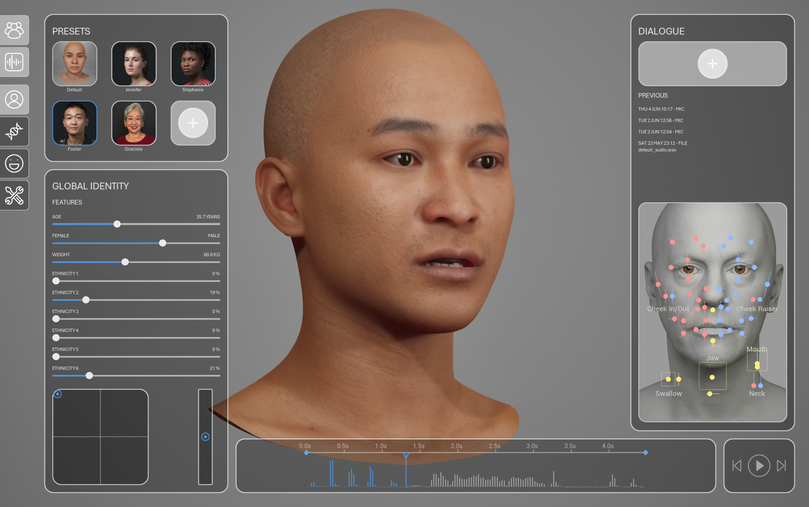

## Background
Humain specialises in digital human creation for video games and screen. Founded in 2017 by Greg Maguire, who led teams at Disney and Lucasfilm Animation, the company builds rigs (digital controls) and characters for major titles including *Halo*, *Call of Duty*, *Microsoft Flight Simulator*, *Diablo II* and *The Outer Worlds 2*. Maguire’s career has run alongside successive waves of new technology in animation -- from the introduction of motion capture to music videos at Colossal Pictures in the early 1990s, to retraining traditional 2D animators to work on Disney’s first 3D feature film. Humain was set up with a similar structure to those larger studios: a production team works directly with clients and feeds requirements and needs to an internal R&D team, whose job is to explore and build tools to keep abreast of innovations.

:::{.column-body}
{fig-alt="Screenshot of the Humain Creator platform, courtesy of Humain. A 3D character-creation interface showing a realistic digital human head in the center, facing slightly to the right with mouth slightly open. Surrounding panels include preset character thumbnails in the top left, a “Global Identity” section with sliders for age, sex, weight, and multiple ethnicity percentages, and a timeline with audio waveform along the bottom. On the right, a “Dialogue” panel displays previous recordings and a facial rig control map overlay with colored points and labels for facial movements such as mouth, jaw, neck, and cheek controls. The interface has a dark grey, modern UI design."}
:::

::: figure-caption
Screenshot of the Humain Creator platform, courtesy of Humain.
:::

## Application of AI 
Around 2020, a published research paper demonstrated a digital character speaking with no rig at all, its facial movements instead driven directly by an audio file. For Maguire, this was "an existential crisis": if a mesh could be animated from sound alone, the case for commissioning a studio to do that work could become much harder to make. The team's response was to look at what those early audio-to-mesh models actually needed, and where the gaps were in both functionality and quality. Existing public datasets were poor quality, focused on proof-of-concept and academic application. Creating production-ready models relies on high quality, standardised motion data, and Humain's core work was creating exactly the kind of high-fidelity character databases they lacked. 

Working with chief scientific officer Erica Rosenberg, the Humain team captured 40 facial action units (FACS), a standardised annotation system for expressions, plus 100 common combinations, then wrote software to transfer those from a source subject to other characters, adding new approaches and features over time. The studio has published around 30 peer-reviewed papers on computer vision covering encoding and decoding strategies, identity tracking, and expression transfer. One finding from this work came as a surprise: because the model had been trained on phonetically-diverse audio rather than language-specific data, it worked in Japanese, Chinese, French, Polish and other languages without major additional training.  

This work led to the development of Humain Creator, a tool that generates and lip-syncs 3D characters from an audio file, in any language, in any engine, without rigging, with characters adjustable by age, build or facial feature in milliseconds.

::: {.column-body}
::: {.pullquote-container}
::: {.pullquote}
"We thought we were training [our model] in language, but we were actually training it with sound."
:::
:::

::: figure-caption
Greg Maguire, founder, Humain.
:::

:::

## Applying the CoSTAR Foresight Lab AI roadmap
Our AI roadmap is organised around three strategic outcomes – frameworks, targeted support, and growth – and driven by nine recommendations that seek to align technological advancement with ethical responsibility and economic opportunity, ensuring long-term growth and success of the UK screen sector.

#### How this case study aligns with the roadmap

- **Responsible AI**
  : Humain has trained its models on datasets the company has captured, with full clearance and knowledge of the pipeline. This kind of approach, whilst requiring use-specific skillsets and knowledge, makes commercial use of the technology straightforward.

- **Investment**
  : Humain’s published research work has been supported by Innovate UK, Northern Ireland Screen and Invest NI. Without public funding it would not have happened, says Maguire: “Without it, we would not have been able to do it. Every single R&D thing that we would have had to do would have been directly applied to exactly what we're doing at that moment in time.”

- **Sector adaptation**
  : Humain's trajectory -- from a studio commissioned to build facial rigs, to a company developing tools that can help increase throughput and enhance creativity -- is an example of how deep production expertise, when combined with sustained R&D investment, can position a modest UK company at the frontier of a fast-moving technology field.

## Resources
- [Humain Studios](https://www.humain-studios.com)

::: {.grid .gap-3 .pb-3 .pt-4}
::: {.g-col-12 .g-col-sm-6}

[Find more case studies](/case-studies/index.qmd){.btn-action .btn .btn-lg .w-100 role="button"}

:::
::: {.g-col-12 .g-col-sm-6 .mb-2}

[Read the report](https://cms.costarnetwork.co.uk/api/media/file/ai-in-the-screen-sector.pdf){.btn-action .btn .btn-lg .w-100 role="button"}

::: 
::: 