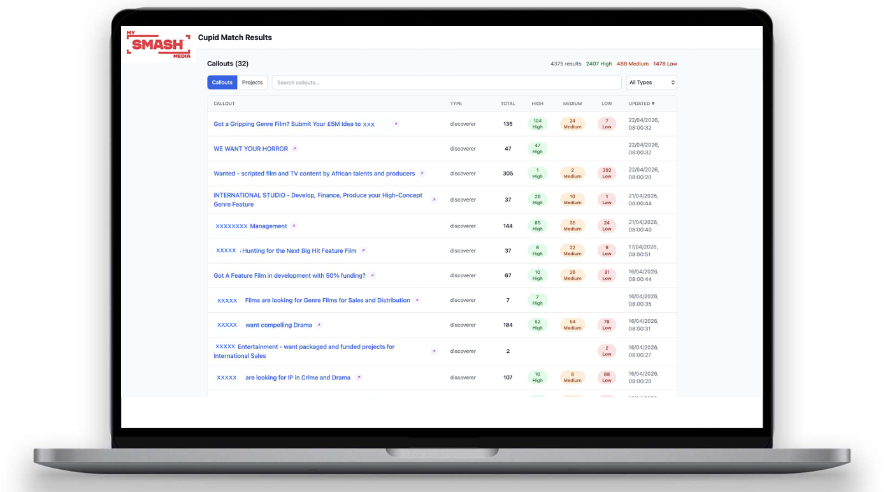

## Background

My SMASH Media is a platform designed to connect IP creators with IP buyers such as commissioners, producers, sales agents, financiers and service providers. It was co-founded by chief executive Fiona Gillies, chief operating officer Christine Hartland and chief product officer Mahesh Ramachandra, born out of challenges Gillies and Hartland had experienced working as producers – either in trying to get their ideas in front of the right people, or finding the right projects. Gillies and Hartland met as part of a Creative England co-producers lab, where they pitched the idea of using technology to overcome these challenges. They then started working with Ramachandra to build the platform.

The concept, in a nutshell, is something like a dating app, says Gillies. Creators setup a profile where they can create pitches for their IP using an industry-standard pitch builder, while financiers or production companies create a callout for the kinds of project they are hoping to find, based on type, format and other criteria. In the middle sits the SMASHCupid team, whose role is to match projects to IP buyers' briefs and callouts, assisted by an agentic AI layer that helps surface the most promising ideas in terms of alignment or fit.

:::{.column-body}
{fig-alt="Screenshot of My SMASH Media's SMASHCupid match results page, in tabular form. The table lists IP buyer callouts and number of matching projects, categorised and colour-coded by match strength (high = green, medium = amber, low = red)."}
:::

::: figure-caption
Screenshot of My SMASH Media's SMASHCupid match results page, listing IP buyer callouts and number of matching projects, categorised by match strength (high, medium, low). Courtesy of My SMASH Media.
:::

## Application of AI

Grants from Innovate UK and Scottish Enterprise have allowed My SMASH Media to develop AI integrations that support the platform and its users in several ways. 

Firstly, the SMASHCupid team works with IP buyers and an AI brief builder tool to develop callouts for the platform.

When a new callout goes live, the platform’s agentic AI will crawl through all listed projects on the site to find those that meet a certain threshold of alignment. For example, it may flag projects that meet 80% of the callout criteria. Those creators will then be notified and offered pointers on aspects of their project that might be adjusted to improve the fit.

At the creator end, the platform integrates AI tools to support the drafting and refinement of log lines and synopses, and the team are investigating additional tools that could support creators to repackage their ideas for different formats: in other words, encouraging creators to think about their IP across the wider creative spectrum, not just one creative vertical.

My SMASH Media’s aim is not to replace the human element in IP discovery, says Gillies, "but we are keen to make it a lot easier for the human element to find projects quickly and efficiently. That's what our tool is doing. It's going through everything on the platform, highlighting the ones that fit, emailing the creators to remind them, contacting them and nudging them about their projects, and then again highlighting new \[projects\]. But it’s the humans who make the decisions about what to include on the final slate that the IP buyers receive."

::: {.column-body}
::: {.pullquote-container}
::: {.grid .gap-6 .pb-3 .pt-4}
::: {.g-col-12 .g-col-sm-12}
::: {.pullquote}
"Our AI tech has grown out of problems we’ve experienced firsthand. SMASH makes it much easier for creative talent in the UK to get their work in front of the people who need that creative IP. Simple, effective filtering and curation."
:::
:::
::: {.g-col-12 .g-col-sm-12}
::: figure-caption
Fiona Gillies, co-founder and chief executive officer, My SMASH Media
:::
:::
:::
:::
:::

## Applying the CoSTAR Foresight Lab AI roadmap

Our AI roadmap is organised around three strategic outcomes – frameworks, targeted support, and growth – and driven by nine recommendations that seek to align technological advancement with ethical responsibility and economic opportunity, ensuring long-term growth and success of the UK screen sector.

### How this case study aligns with the roadmap

* **Responsible AI**  
  My SMASH Media’s AI layer does not train on scripts or other IP inputs, nor does it make final decisions on which projects to present to IP buyers. This remains the role of the SMASHCupid team, working from lists of projects scored by AI models based on an assigned high, medium or low match rating.  
     
* **Investment**  
  Development of My SMASH Media has been supported by angel investors, a grant from Innovate UK (Smart & Future Economies in the Creative Industries), and a research and development grant from Scottish Enterprise to create the agentic AI matchmaking tool.  
    
* **Independent creation**  
  Within the My SMASH Media platform, creators have the option to work with AI tools to hone project pitches, potentially improving discoverability and chances of selection. 

## Resources

* [My SMASH Media homepage](https://www.mysmash.media/)

::: {.grid .gap-3 .pb-3 .pt-4}
::: {.g-col-12 .g-col-sm-6}

[Find more case studies](/case-studies/index.qmd){.btn-action .btn .btn-lg .w-100 role="button"}

:::
::: {.g-col-12 .g-col-sm-6 .mb-2}

[Read the report](https://cms.costarnetwork.co.uk/api/media/file/ai-in-the-screen-sector.pdf){.btn-action .btn .btn-lg .w-100 role="button"}

::: 
::: 