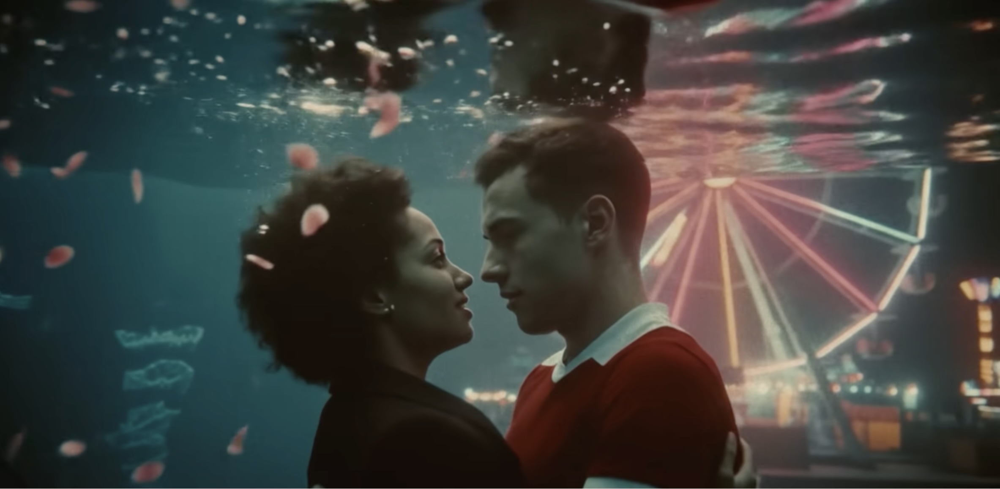

## Background
[Wonder Studios](https://wonderstudios.com/) is a London-based, AI-native film and content studio born out of a community. Through its agency arm, it works with award-winning brands and artists on commercials, music videos and branded content. Alongside this sits an original IP business, including the anthology _Beyond the Loop_ and upcoming long-form projects, along with a growing co-production slate. 

Founded in 2025 by filmmaker Justin Hackney and  entrepreneur Xavier Collins, Wonder has raised over $15 million, with investors including Atomico, LocalGlobe, Blackbird and Adobe Ventures, with angel investment from individuals across ElevenLabs, OpenAI, Google DeepMind and the wider entertainment and technology industry. The company is also supported by senior advisors spanning film, marketing and studio-building, including Danny Perkins (Founder & CEO, Elysian Film Group) and Jackie Lee-Joe (former CMO of Netflix and BBC Studios), who work closely with Wonder’s leadership across creative, commercial and audience strategy.

:::{.column-body}
{fig-alt="A still from _Something in the Heavens_"}
:::

::: figure-caption
Wonder Studios
:::

## Application of AI 

### Music video production: _Something in the Heavens_

Wonder produced a music video for Lewis Capaldi's Something in the Heavens, working with Google DeepMind, YouTube and Universal Music Group, built using Google's Flow filmmaking tool. Nine creative technologists worked across time zones in a 24-hour production cycle under Hackney's direction, generating material that was then edited down, typically one or two sequences kept from every hundred generated. Hackney describes the experience:

::: {.column-page}
::: {.pullquote-container}
::: {.pullquote}
"Flow allowed us to explore those ideas without constraint. There was no sense of limitation, just a fluid back and forth between instinct and image."
:::
:::

::: figure-caption
Justin Hackney co-founder, Wonder Studios.
:::
:::

The finished material was transferred to 8mm and 16mm film stock and back to digital, giving the footage a distinct analogue grain, then finished with conventional editing and colour grading.

### Short film anthology : _Beyond the Loop_

_Beyond the Loop_ is an anthology series, bringing together a new generation of filmmakers using AI-assisted production workflows to develop original films. The first season established a format, the second was produced with support from CapCut, in Video, ElevenLabs and OpenaArt. Across both seasons the anthology has amassed over 6.5 million views on YouTube, and coverage in Deadline, Forbes and NBC. The aim of the programme is to back a new generation of filmmakers outside traditional studio routes, and provide the infrastructure to build their own IP in public.

### IP ownership: giving filmmakers a stake
Alongside its production work, Wonder has developed a legal and commercial framework designed to clarify IP ownership for filmmakers on AI-native projects. Modelled on the SAFE instrument used in early-stage startup funding, it treats a short film as a prototype: if the project develops into a series or feature, the filmmaker shares in the upside as a partner, with transparent terms in place of the opaque net points arrangements typical of traditional film contracts. First tested on Beyond the Loop, Collins describes it “as a Y Combinator-style model where AI makes filmmakers founders”.

## Applying the CoSTAR Foresight Lab AI roadmap
Our AI roadmap is organised around three strategic outcomes – frameworks, targeted support, and growth – and driven by nine recommendations that seek to align technological advancement with ethical responsibility and economic opportunity, ensuring long-term growth and success of the UK screen sector.

#### How this case study aligns with the roadmap

- **Independant creation**
  : Wonder's model demonstrates that small, distributed teams can produce broadcast-quality work without traditional resource bases — and that structured programmes like _Beyond the Loop_ can give independent filmmakers a replicable route to production support, capital and commercial infrastructure, enabled by new tools and technologies.

- **Responsible AI**
  : The production of _Something in the Heavens_, with extensive generation followed by human curation and analogue post-processing, reflects a considered position on the role of generative tools. Editorial decisions remained with the creative team throughout

- **Sector adaptation**
  : Wonder's IP framework addresses a mismatch between the economics of AI-assisted production and contractual norms inherited from traditional film. Already tested on projects including _Beyond the Loop_, and now applied as an open instrument, it offers a model for how organisations might structure agreements with AI-native creators.

## Resources
- [Lewis Capaldi's _Something in the Heavens_](https://www.youtube.com/watch?v=aVUuXuzd7nY&list=RDaVUuXuzd7nY&start_radio=1)
- [Beyond the Loop Season 1](https://www.youtube.com/playlist?list=PLyp0r0dcKEGPVAMw9Xv_tnODTAmeKIKpj)
- [Beyond the Loop Season 2](https://www.youtube.com/playlist?list=PLyp0r0dcKEGPrvI1oGWUAw2aCfEBSDiUQ)
- [DREAM Framework](https://wonderstudios.substack.com/p/building-y-combinator-for-filmmaking)

::: {.grid .gap-3 .pb-3 .pt-4}
::: {.g-col-12 .g-col-sm-6}

[Find more case studies](/case-studies/index.qmd){.btn-action .btn .btn-lg .w-100 role="button"}

:::
::: {.g-col-12 .g-col-sm-6 .mb-2}

[Read the report](https://cms.costarnetwork.co.uk/api/media/file/ai-in-the-screen-sector.pdf){.btn-action .btn .btn-lg .w-100 role="button"}

::: 
::: 